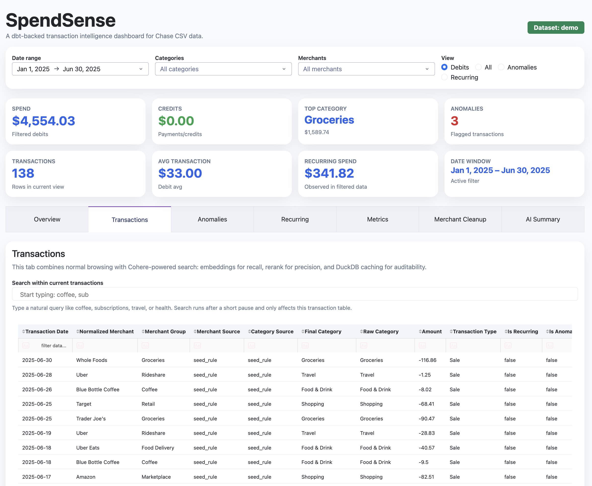

# SpendSense

**Live demo:** https://spend-sense-mcpo.onrender.com/  
Hosted with demo data only.

[](https://spend-sense-mcpo.onrender.com/)

AI-assisted spend analytics from a Chase credit card CSV.

## Stack

- Python
- DuckDB
- dbt + dbt-duckdb
- Dash + Plotly
- Cohere API

## Documentation

- HTML system guide: `docs/spendsense_system_breakdown.html`
- Markdown system guide: `docs/spendsense_system_breakdown.md`
- Build log / implementation notes: `build_notes.md`

## Local setup

```bash
python3 -m venv .venv
source .venv/bin/activate
pip install -r requirements.txt
cp .env.example .env
```

## Data modes

- `demo`: uses `data/demo/chase_transactions_demo.csv`
- `private`: uses your local Chase CSV at `data/private/chase_transactions.csv`

Private data is gitignored.

## Pipeline

```bash
python scripts/generate_demo_data.py
python scripts/ingest_chase_csv.py
cd dbt && dbt deps --profiles-dir . && dbt build --profiles-dir .
cd ..
python app/app.py
```

## Modeled analytics

The dbt layer includes reusable marts for transactions, recurring spend, anomalies, merchant cleanup, and metrics:

- global spend KPIs
- monthly KPIs with guarded month-over-month changes
- category concentration and volatility metrics
- AI/data-quality coverage by merchant/category source

The Dash app includes a Metrics tab that surfaces these definitions and denominator choices.
It also includes a Cohere-powered semantic search flow with embeddings + rerank, cached locally in DuckDB.
