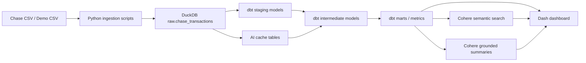

# SpendSense System Breakdown

A portfolio-ready walkthrough of how SpendSense is set up, how the pipeline works, how dbt models the data, how Python and Dash consume it, and how Cohere is used across the system.

- **Repo:** https://github.com/jdavid459/spend-sense
- **HTML guide:** [docs/spendsense_system_breakdown.html](./spendsense_system_breakdown.html)
- **Build notes:** [build_notes.md](../build_notes.md)

---

## What SpendSense is

SpendSense is a personal spend analytics project designed to showcase:

- **analytics engineering** with dbt
- **data engineering** with Python + DuckDB
- **dashboarding** with Dash + Plotly
- **applied AI** with Cohere for enrichment, semantic search, rerank, and summaries

The project is intentionally structured to be easy to explain in interviews:

- raw financial events come in as CSV rows
- Python ingests them into DuckDB
- dbt turns them into governed models and metrics
- Dash presents the analytics product
- Cohere adds AI capabilities on top without becoming the source of truth

---

## Interview-friendly framing

### Analytics engineering
- clear model layering
- reusable fact and mart design
- explicit denominator choices
- rolling window metrics
- data quality and provenance coverage

### Data engineering
- mode-aware ingestion
- deterministic reload pattern
- local warehouse design with DuckDB
- API retry and rate-limit handling
- offline backfills and cache tables

### Applied AI governance
- AI outputs are cached
- confidence is stored
- provenance is preserved
- deterministic rules take precedence over AI outputs
- AI coverage/fallback is measured downstream

---

## Quick setup

```bash
python3 -m venv .venv
source .venv/bin/activate
pip install -r requirements.txt
cp .env.example .env

python scripts/generate_demo_data.py
python scripts/ingest_chase_csv.py
cd dbt && dbt deps --profiles-dir . && dbt build --profiles-dir .
cd ..
python app/app.py
```

### Data modes

- **demo** → uses [`data/demo/chase_transactions_demo.csv`](https://github.com/jdavid459/spend-sense/blob/main/data/demo/chase_transactions_demo.csv)
- **private** → uses a local Chase CSV in `data/private/`

Relevant files:
- [`src/config.py`](https://github.com/jdavid459/spend-sense/blob/main/src/config.py)
- [`.env.example`](https://github.com/jdavid459/spend-sense/blob/main/.env.example)
- [`scripts/ingest_chase_csv.py`](https://github.com/jdavid459/spend-sense/blob/main/scripts/ingest_chase_csv.py)

---

## End-to-end architecture



### Main design principle

**dbt owns the business logic.**

Python is mainly responsible for:
- ingestion
- cache/table management
- Cohere API calls
- Dash callbacks and presentation

This keeps metric definitions, grains, and transformation rules inside dbt where they are easier to test and explain.

---

## How the pipeline works

| Stage | What happens | Relevant files |
|---|---|---|
| Input selection | Chooses demo vs private mode and resolves file paths | [`src/config.py`](https://github.com/jdavid459/spend-sense/blob/main/src/config.py) |
| Demo generation | Creates synthetic data with recurring charges, anomalies, and messy merchants | [`scripts/generate_demo_data.py`](https://github.com/jdavid459/spend-sense/blob/main/scripts/generate_demo_data.py) |
| Ingestion | Validates Chase columns, adds lineage fields, writes raw table into DuckDB | [`scripts/ingest_chase_csv.py`](https://github.com/jdavid459/spend-sense/blob/main/scripts/ingest_chase_csv.py) |
| Modeling | dbt builds staging, intermediate, and marts | [`dbt/`](https://github.com/jdavid459/spend-sense/tree/main/dbt) |
| Dashboard | Dash reads marts into pandas and renders charts/tables | [`app/app.py`](https://github.com/jdavid459/spend-sense/blob/main/app/app.py) |
| AI layer | Cohere enriches, summarizes, embeds, and reranks | [`src/`](https://github.com/jdavid459/spend-sense/tree/main/src) |

---

## How dbt is used

SpendSense uses dbt as the core analytics engineering layer.

### dbt project files
- [`dbt/dbt_project.yml`](https://github.com/jdavid459/spend-sense/blob/main/dbt/dbt_project.yml)
- [`dbt/profiles.yml`](https://github.com/jdavid459/spend-sense/blob/main/dbt/profiles.yml)
- [`dbt/macros/generate_schema_name.sql`](https://github.com/jdavid459/spend-sense/blob/main/dbt/macros/generate_schema_name.sql)

### Layering

#### 1. Staging
Purpose: clean and standardize raw Chase data.

Key model:
- [`dbt/models/staging/stg_chase_transactions.sql`](https://github.com/jdavid459/spend-sense/blob/main/dbt/models/staging/stg_chase_transactions.sql)

What it does:
- parses dates
- creates debit/credit flags
- standardizes descriptions
- keeps one row per source transaction

#### 2. Intermediate
Purpose: apply business logic before the final marts.

Key models:
- [`int_merchant_normalization.sql`](https://github.com/jdavid459/spend-sense/blob/main/dbt/models/intermediate/int_merchant_normalization.sql)
- [`int_transaction_features.sql`](https://github.com/jdavid459/spend-sense/blob/main/dbt/models/intermediate/int_transaction_features.sql)
- [`int_recurring_transactions.sql`](https://github.com/jdavid459/spend-sense/blob/main/dbt/models/intermediate/int_recurring_transactions.sql)

What they do:
- normalize merchants
- apply deterministic rule precedence
- incorporate Cohere cache when confidence is high enough
- create final category values
- calculate z-scores and merchant/category comparisons
- detect recurring behavior heuristically

#### 3. Marts
Purpose: expose governed, dashboard-ready analytics tables.

Key models:
- [`fct_transactions.sql`](https://github.com/jdavid459/spend-sense/blob/main/dbt/models/marts/fct_transactions.sql)
- [`mart_anomalies.sql`](https://github.com/jdavid459/spend-sense/blob/main/dbt/models/marts/mart_anomalies.sql)
- [`mart_recurring_spend.sql`](https://github.com/jdavid459/spend-sense/blob/main/dbt/models/marts/mart_recurring_spend.sql)
- [`mart_merchant_review.sql`](https://github.com/jdavid459/spend-sense/blob/main/dbt/models/marts/mart_merchant_review.sql)
- [`mart_daily_metric_values.sql`](https://github.com/jdavid459/spend-sense/blob/main/dbt/models/marts/mart_daily_metric_values.sql)

### Why dbt is a strong part of the project

It shows:
- model layering discipline
- reusable business logic
- clear grains
- testable transformations
- analytics products beyond a dashboard

---

## How the data is modeled

### Core lineage

```text
raw.chase_transactions
  -> staging.stg_chase_transactions
  -> intermediate.int_merchant_normalization
  -> intermediate.int_transaction_features
  -> intermediate.int_recurring_transactions
  -> marts.fct_transactions
  -> marts for recurring, anomalies, merchant review, and metrics
```

### Important grains

| Model | Grain | Why it matters |
|---|---|---|
| `stg_chase_transactions` | one row per raw transaction | standardized event layer |
| `int_merchant_normalization` | one row per transaction | merchant/category resolution with provenance |
| `int_transaction_features` | one row per transaction | anomaly and spacing features |
| `fct_transactions` | one row per transaction | core fact table for the app |
| `mart_merchant_review` | one row per raw description + merchant combo | operational cleanup surface |
| `mart_daily_metric_values` | one row per metric per day per dimension combo | filterable rolling metric layer |

### Merchant normalization precedence

```text
seed rule > Cohere cache (confidence >= 0.70) > raw fallback
```

This is important because it keeps AI controlled.

Relevant files:
- [`dbt/seeds/merchant_rules.csv`](https://github.com/jdavid459/spend-sense/blob/main/dbt/seeds/merchant_rules.csv)
- [`dbt/models/staging/stg_ai_merchant_enrichments.sql`](https://github.com/jdavid459/spend-sense/blob/main/dbt/models/staging/stg_ai_merchant_enrichments.sql)
- [`dbt/models/intermediate/int_merchant_normalization.sql`](https://github.com/jdavid459/spend-sense/blob/main/dbt/models/intermediate/int_merchant_normalization.sql)

### Metric modeling

Important metric marts:
- [`mart_spend_kpis.sql`](https://github.com/jdavid459/spend-sense/blob/main/dbt/models/marts/mart_spend_kpis.sql)
- [`mart_monthly_kpis.sql`](https://github.com/jdavid459/spend-sense/blob/main/dbt/models/marts/mart_monthly_kpis.sql)
- [`mart_category_metrics.sql`](https://github.com/jdavid459/spend-sense/blob/main/dbt/models/marts/mart_category_metrics.sql)
- [`mart_data_quality.sql`](https://github.com/jdavid459/spend-sense/blob/main/dbt/models/marts/mart_data_quality.sql)
- [`mart_metric_summary.sql`](https://github.com/jdavid459/spend-sense/blob/main/dbt/models/marts/mart_metric_summary.sql)
- [`mart_daily_metric_values.sql`](https://github.com/jdavid459/spend-sense/blob/main/dbt/models/marts/mart_daily_metric_values.sql)

### Analytics engineering highlights

The metrics layer demonstrates:
- debit-only spend denominators
- separation of payments/credits from spend
- rolling 30-day comparisons
- anomaly exposure
- recurring burden
- concentration metrics
- AI coverage and fallback measurement

---

## How data flows into Python and Dash

### DuckDB access

[`src/db.py`](https://github.com/jdavid459/spend-sense/blob/main/src/db.py) provides a simple helper that queries DuckDB and returns pandas DataFrames.

### App entrypoint

[`app/app.py`](https://github.com/jdavid459/spend-sense/blob/main/app/app.py) does the following:
- loads modeled marts from DuckDB
- applies global filters
- renders KPI cards
- renders tabs for overview, transactions, anomalies, recurring, metrics, merchant cleanup, and AI summary

### Componentized app features

- [`app/components/ai_summary.py`](https://github.com/jdavid459/spend-sense/blob/main/app/components/ai_summary.py)
- [`app/components/semantic_search.py`](https://github.com/jdavid459/spend-sense/blob/main/app/components/semantic_search.py)

### Main dashboard-to-model mapping

| Dashboard feature | Main data source |
|---|---|
| Overview | `marts.fct_transactions` |
| Transactions | `marts.fct_transactions` |
| Anomalies | `marts.mart_anomalies` + transaction fact |
| Recurring | `marts.mart_recurring_spend` |
| Metrics | `marts.mart_daily_metric_values` |
| Merchant Cleanup | `marts.mart_merchant_review` |
| AI Summary | filtered `fct_transactions` + `mart_daily_metric_values` |

---

## How Cohere is used

SpendSense uses multiple Cohere products.

| Cohere product | Purpose | Relevant files |
|---|---|---|
| Chat | merchant enrichment, merchant profiles, grounded summaries | [`scripts/enrich_merchants.py`](https://github.com/jdavid459/spend-sense/blob/main/scripts/enrich_merchants.py), [`src/merchant_profiles.py`](https://github.com/jdavid459/spend-sense/blob/main/src/merchant_profiles.py), [`src/cohere_client.py`](https://github.com/jdavid459/spend-sense/blob/main/src/cohere_client.py) |
| Embed | semantic transaction search | [`src/semantic_search.py`](https://github.com/jdavid459/spend-sense/blob/main/src/semantic_search.py), [`scripts/backfill_transaction_embeddings.py`](https://github.com/jdavid459/spend-sense/blob/main/scripts/backfill_transaction_embeddings.py) |
| Rerank | search precision improvement | [`src/semantic_search.py`](https://github.com/jdavid459/spend-sense/blob/main/src/semantic_search.py) |

### 1. Merchant enrichment

Unmapped merchant descriptions are sent to Cohere Chat.

The response includes:
- suggested merchant name
- suggested category
- suggested merchant group
- confidence
- reasoning

Results are cached in DuckDB and then consumed back through dbt.

### 2. Grounded AI summary

The AI Summary tab works in two layers:
- deterministic summary first
- Cohere-written summary on demand

The summary is grounded in:
- filtered transactions
- rolling 30-day metrics
- modeled anomaly and recurring context

### 3. Semantic transaction search

Search uses a retrieval pipeline:
1. build transaction search text
2. embed transactions with Cohere Embed
3. embed the query
4. score semantic similarity
5. combine with lightweight lexical scoring
6. rerank candidates with Cohere Rerank
7. show only confident results

### 4. Merchant semantic profiles

Merchant-level profiles are generated with Cohere Chat and stored locally.
These profiles are then appended to transaction search text to improve search recall for intent-style queries.

### AI governance pattern

AI outputs are treated as governed data assets:
- cached in DuckDB
- not silently trusted
- confidence-aware
- auditable
- downstream measurable

Relevant cache definitions:
- [`src/ai_cache.py`](https://github.com/jdavid459/spend-sense/blob/main/src/ai_cache.py)

---

## Repo map

### Core docs
- [`README.md`](https://github.com/jdavid459/spend-sense/blob/main/README.md)
- [`build_notes.md`](https://github.com/jdavid459/spend-sense/blob/main/build_notes.md)
- [`docs/spendsense_system_breakdown.html`](https://github.com/jdavid459/spend-sense/blob/main/docs/spendsense_system_breakdown.html)
- [`docs/spendsense_system_breakdown.md`](https://github.com/jdavid459/spend-sense/blob/main/docs/spendsense_system_breakdown.md)

### Ingestion + scripts
- [`scripts/`](https://github.com/jdavid459/spend-sense/tree/main/scripts)

### dbt
- [`dbt/models/staging/`](https://github.com/jdavid459/spend-sense/tree/main/dbt/models/staging)
- [`dbt/models/intermediate/`](https://github.com/jdavid459/spend-sense/tree/main/dbt/models/intermediate)
- [`dbt/models/marts/`](https://github.com/jdavid459/spend-sense/tree/main/dbt/models/marts)
- [`dbt/seeds/merchant_rules.csv`](https://github.com/jdavid459/spend-sense/blob/main/dbt/seeds/merchant_rules.csv)

### App
- [`app/app.py`](https://github.com/jdavid459/spend-sense/blob/main/app/app.py)
- [`app/components/`](https://github.com/jdavid459/spend-sense/tree/main/app/components)

### AI / Cohere layer
- [`src/cohere_client.py`](https://github.com/jdavid459/spend-sense/blob/main/src/cohere_client.py)
- [`src/ai_summary.py`](https://github.com/jdavid459/spend-sense/blob/main/src/ai_summary.py)
- [`src/semantic_search.py`](https://github.com/jdavid459/spend-sense/blob/main/src/semantic_search.py)
- [`src/merchant_profiles.py`](https://github.com/jdavid459/spend-sense/blob/main/src/merchant_profiles.py)
- [`src/ai_cache.py`](https://github.com/jdavid459/spend-sense/blob/main/src/ai_cache.py)

---

## Best one-line summary

**SpendSense is an end-to-end analytics product that starts with raw financial events, models them into governed metrics with dbt, and layers AI features on top in a controlled, auditable way.**
